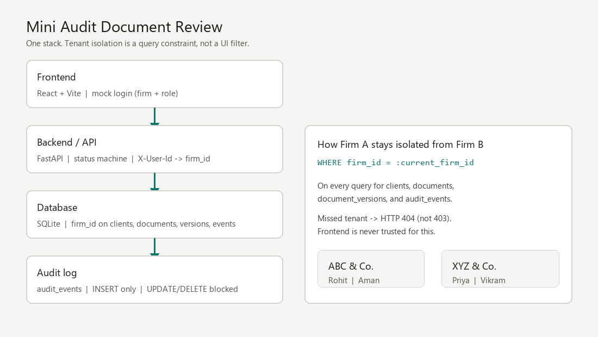
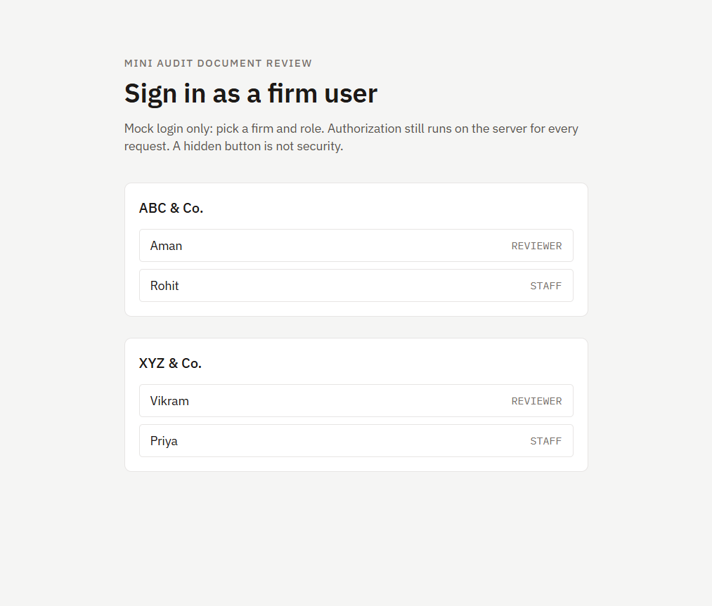
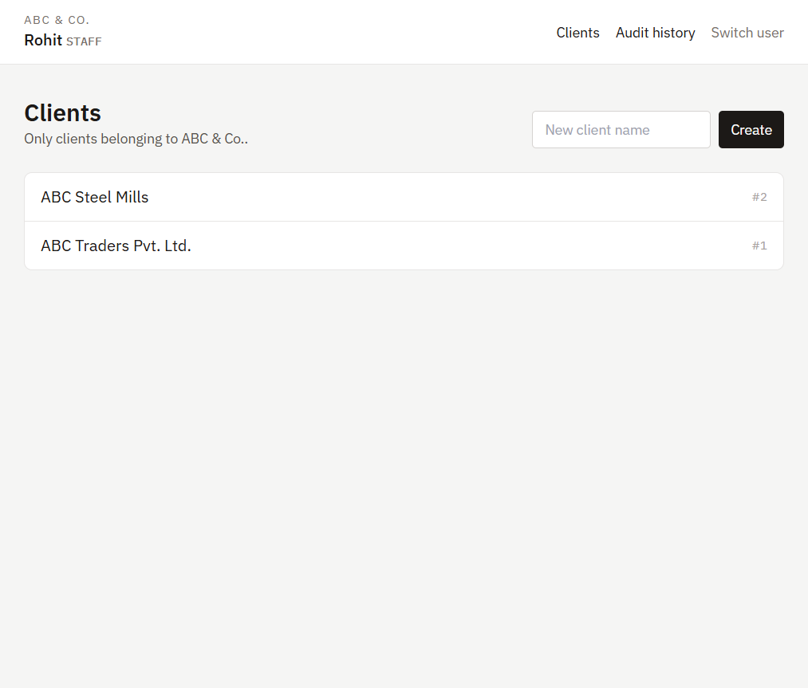
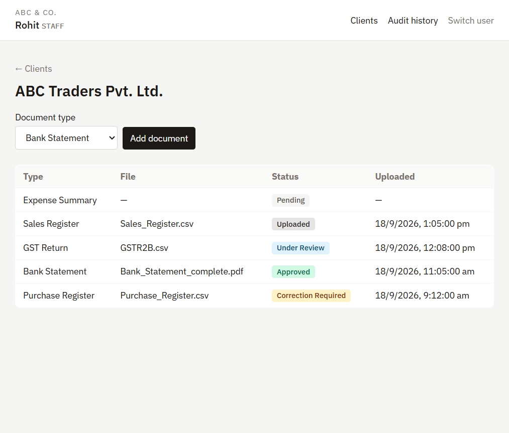
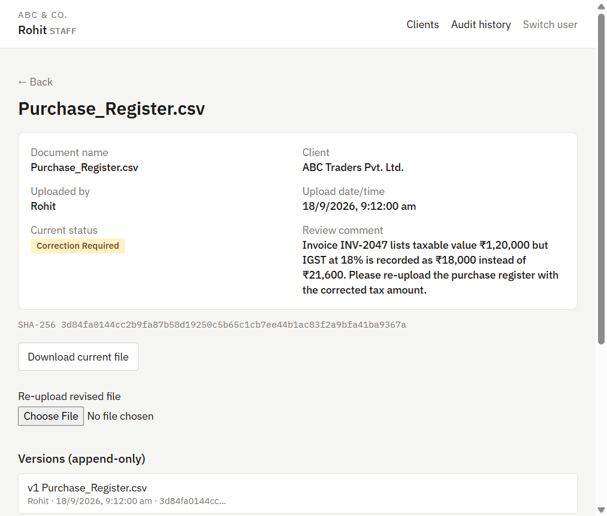
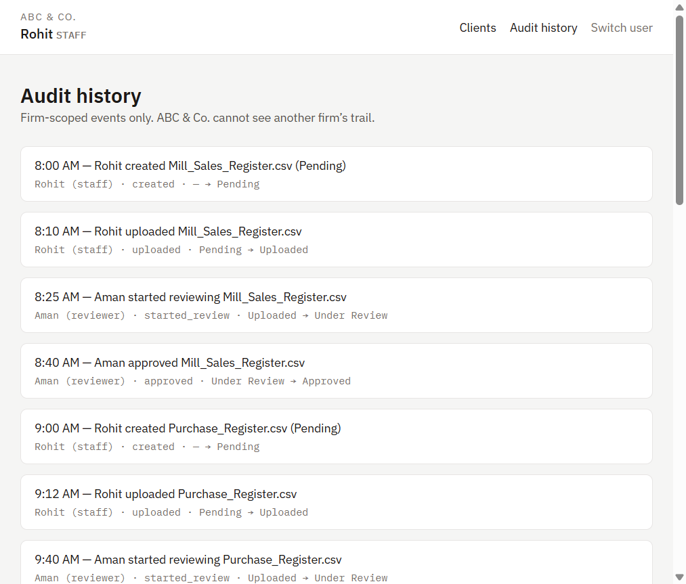

# Mini Audit Document Review System

Take-home for **OBLIQ.in** (Founding Engineer). A CA-firm employee can create/view a client, add audit documents, review them, approve or request correction, and view audit history. That is the full product.

**Live demo:** [https://obliq-mini-audit.onrender.com/](https://obliq-mini-audit.onrender.com/)  
(Free Render instance — first load after idle can take ~30 seconds.)

**Stack (one process, one database, one UI):** FastAPI + SQLite + React (Vite). Chosen because isolation, the status machine, and the append-only audit log live in the backend; the UI is a thin client. No JWT, no extra services, no analytics dashboard.

Authentication is **not** authorization. The login screen is a firm + role picker (`X-User-Id` header). Every client, document, version, and audit query still runs `WHERE firm_id = :current_firm_id` on the server. Hiding a button in React is not security.

---

## Setup

Python 3.11+, Node 18+.

On Windows, **do not activate the venv** if PowerShell blocks scripts, and **do not** `pip install` into global Python (that overwrites other projects). Call the venv interpreter by path. Skip `python -m venv .venv` if `.venv` already exists — recreating it fails while a server still has `python.exe` open.

```powershell
cd backend
.\.venv\Scripts\python.exe -m pip install -r requirements.txt
.\.venv\Scripts\python.exe seed.py
.\.venv\Scripts\python.exe -m uvicorn app.main:app --reload --port 8000
```

If `Activate.ps1` is blocked and you still want activation for this terminal only:

```powershell
Set-ExecutionPolicy -Scope Process -ExecutionPolicy Bypass
.\.venv\Scripts\Activate.ps1
```

If `seed.py` says `audit.db` is locked, or uvicorn prints `WinError 10013` / permission denied on port 8000, stop the old backend first (`Ctrl+C` in that window). Port 8000 is already in use from the previous run. Then seed and start again.

If 8000 is still forbidden after that, use another port and point the Vite proxy at it:

```powershell
.\.venv\Scripts\python.exe -m uvicorn app.main:app --reload --port 8001
```

```js
// frontend/vite.config.js
proxy: { "/api": "http://127.0.0.1:8001" }
```

```powershell
# Frontend (second terminal). Use npm.cmd — PowerShell blocks npm.ps1
# when script execution is disabled (same policy as Activate.ps1).
cd frontend
npm.cmd install
npm.cmd run dev
```

Open [http://localhost:5173](http://localhost:5173). Vite proxies `/api` to the backend.

## Live demo (free)

**URL:** [https://obliq-mini-audit.onrender.com/](https://obliq-mini-audit.onrender.com/)

One process: FastAPI serves `/api` and the built React app. SQLite on the free tier is wiped when the instance sleeps, so boot runs `seed.py` again. First click after idle can take ~30s.

macOS / Linux:

```bash
cd backend
python -m venv .venv
source .venv/bin/activate
pip install -r requirements.txt
python seed.py
uvicorn app.main:app --reload --port 8000
```

Demo users after seed:

| Firm | User | Role |
| --- | --- | --- |
| ABC & Co. | Rohit | staff |
| ABC & Co. | Aman | reviewer |
| XYZ & Co. | Priya | staff |
| XYZ & Co. | Vikram | reviewer |

Sign in as Rohit, then switch to Aman, then Priya. Firm A never sees XYZ clients or documents — including if you call the API with a Firm B id.

```bash
cd backend
python -m pytest -v
```

---

## Environment

| Item | Value |
| --- | --- |
| Database | SQLite `backend/data/audit.db` (or `DATABASE_URL`) |
| Uploads | `backend/data/uploads/<firm_id>/<document_id>/` (or `UPLOAD_ROOT`) |
| Identity header | `X-User-Id` (mock login) |
| CORS | localhost:5173 only |

No `.env` is required for the local demo.

---

## Architecture



```
Frontend (React / Vite)
   ↓  HTTP + X-User-Id
Backend / API (FastAPI)
   ↓  SQLAlchemy, firm_id on every query
Database (SQLite)
   ↓  INSERT only (triggers block UPDATE/DELETE)
Audit Log (audit_events)
```

State changes never happen only in the UI. The server owns:

1. **Tenant scope** — `queries.py` is the only place that reads clients, documents, versions, or audit rows. Each helper includes `firm_id`.
2. **Status machine** — `transitions.py` is a single table of legal `(from, to, role)` triples. Illegal moves return **400** naming both states (e.g. `Pending → Approved`).
3. **Audit write** — every successful transition inserts exactly one `audit_events` row (actor, role, action, from/to, note, timestamp).
4. **Files** — each upload is a new `document_versions` row plus SHA-256. Re-upload after correction does not overwrite the previous file.

`firm_id` is stored on `documents`, `document_versions`, and `audit_events` (not only via `client_id`). Isolation is a column on the row being queried, so a join cannot be forgotten.

### How does Firm A stay isolated from Firm B?

A user is loaded from `users` by `X-User-Id`. Their `firm_id` is the only tenant the request may touch. List/get/download/audit all add `WHERE firm_id = current_user.firm_id`. If Rohit (ABC & Co.) requests document id 9 and that row belongs to XYZ & Co., the query returns no row and the API returns **404**, not 403. 403 would confirm that the document exists. The React app never receives Firm B payloads to “hide.” Tests in `tests/test_isolation.py` authenticate as Firm A and assert 404 on Firm B get, download, client-by-id, and document audit.

---

## Data model

```
firms(id, name)
users(id, firm_id, name, role)                 -- staff | reviewer
clients(id, firm_id, name)
documents(id, client_id, firm_id, doc_type, current_status, created_at)
document_versions(id, document_id, firm_id, file_path, uploaded_by, uploaded_at, checksum_sha256)
audit_events(id, document_id, firm_id, actor, actor_role, action, from_status, to_status, note, created_at)
```

SQLite triggers `audit_events_no_update` and `audit_events_no_delete` abort mutation with `audit_events is append-only`. Application code cannot “edit history” even with a raw SQL client on this database.

Document types: Bank Statement, Sales Register, Purchase Register, GST Return, Expense Summary.

```
Pending → Uploaded → Under Review → Approved
                                 ↘ Correction Required → Uploaded → Under Review → …
```

---

## Seed data

`python seed.py` creates both firms, staff/reviewer users, two clients per firm, and 5–8 documents covering every status.

| Type | Dataset (brief) | Seed file |
| --- | --- | --- |
| Bank Statement | [AgamiAI/Indian-Bank-Statements](https://huggingface.co/datasets/AgamiAI/Indian-Bank-Statements) `train/.../00001.json` then `00001.pdf` | `Bank_Statement.json` / `Bank_Statement_complete.pdf` |
| Purchase Register | [synthetic-finance-data](https://github.com/AnujSureshkumar/synthetic-finance-data) `output/purchase_register.csv` | `Purchase_Register.csv` |
| GST Return | same repo `output/gstr2b_recon_truth.csv` | `GSTR2B_recon.csv` |
| Sales Register | [invoice-sandbox-benchmark](https://github.com/ciru-ai/invoice-sandbox-benchmark) `answer_key/invoices.csv` | `Sales_Register.csv` |
| Expense Summary | [LedgerBridge](https://github.com/PearlThoughts/LedgerBridge) `examples/pixelcraft-studios/statements/hdfc-ca-apr-2025.csv` | `Expense_Summary.csv` |

Seed pulls **one file per type** (no bulk download). If a remote is unreachable, a labeled synthetic fallback is written instead — that is logged in `backend/data/seed_download_log.txt`.

**Correction Required (real rows, not placeholders):**

- ABC Traders purchase register: `INV-202606-045` Pioneer Consulting LLP is Inter-state with `reverse_charge=Yes` but IGST = 0 and `invoice_total` = taxable ₹67,100. Aman asks for IGST ₹12,078 (18%) or RCM working.
- ABC Traders bank statement: first version is the AgamiAI JSON extract; Aman requests the paired PDF because page 3 (closing balance) is missing. Rohit re-uploads `00001.pdf`.
- XYZ purchase/GST uses `CAT/26-27/1017` `VALUE_MISMATCH` (GSTR-2B ₹7,04,000 vs books ₹7,60,300) from `gstr2b_recon_truth.csv`.

---

## Tests (real output)

```
============================= test session starts =============================
platform win32 -- Python 3.11.9, pytest-8.3.4, pluggy-1.6.0
rootdir: C:\Users\riyas\OneDrive\New folder (3)\backend
configfile: pytest.ini
plugins: anyio-4.15.1
collected 14 items

tests/test_audit_and_versions.py::test_audit_events_update_blocked PASSED
tests/test_audit_and_versions.py::test_audit_events_delete_blocked PASSED
tests/test_audit_and_versions.py::test_each_transition_creates_one_audit_event PASSED
tests/test_audit_and_versions.py::test_reupload_creates_new_version_keeps_old PASSED
tests/test_isolation.py::test_firm_a_cannot_get_firm_b_document PASSED
tests/test_isolation.py::test_firm_a_cannot_download_firm_b_document PASSED
tests/test_isolation.py::test_firm_a_cannot_list_firm_b_clients PASSED
tests/test_isolation.py::test_firm_a_cannot_fetch_firm_b_client_by_id PASSED
tests/test_isolation.py::test_firm_a_cannot_list_firm_b_documents PASSED
tests/test_isolation.py::test_firm_a_cannot_read_firm_b_document_audit PASSED
tests/test_isolation.py::test_firm_a_audit_feed_excludes_firm_b_events PASSED
tests/test_transitions.py::test_pending_to_approved_rejected PASSED
tests/test_transitions.py::test_empty_correction_comment_rejected PASSED
tests/test_transitions.py::test_empty_string_comment_rejected_by_validation PASSED

======================== 14 passed, 1 warning in 6.25s ========================
```

What each group proves:

- **Isolation** — Firm A get/download/list of Firm B data is 404 (or omitted from lists). Audit feed is firm-scoped.
- **Transitions** — `Pending → Approved` is 400 and names both statuses. Empty correction comments are rejected.
- **Audit / versions** — SQL `UPDATE`/`DELETE` on `audit_events` fails. Each transition writes one populated event. Re-upload inserts a second version and keeps the first checksum.

---

## Screenshots









  

Record a 3–5 minute unedited demo in this order: login → client create/view → upload → review → correction or approve → audit history → 30 seconds on isolation (`firm_id` + 404).

---

## What would you improve if you had one more week?

**1. Replace the role picker with a real session, still without building OAuth.** Issue an HttpOnly cookie after a one-time staff/reviewer login table (hashed password or magic link). Keep `firm_id` resolution on the server. The current `X-User-Id` header is enough to demonstrate authorization, but a CA firm will impersonate another user by editing DevTools. Session cookies close that hole without expanding product scope.

**2. Notify staff when a reviewer requests correction.** On `REQUESTED_CORRECTION`, write to a `notifications` table (and optionally SMTP). The workflow already stores the reason; staff should not have to poll the document list. I would not spend the week on GST filing, WhatsApp, or an analytics dashboard — those are out of scope and would dilute the isolation story.

---

## AI Tools Used:

ChatGPT:

Claude:

Gemini:

Cursor: occasional syntax / docs lookup in the editor. Not used to design the data model or isolation.

GitHub Copilot:

How AI was used:

I wrote the schema, tenant-scoped queries, status machine, audit triggers, tests, seed mapping, and UI flow myself. Cursor was only used for small mechanical bits (e.g. pytest fixture wiring). I did not generate the architecture or the authorization rules from a prompt.

One suggestion I rejected: returning 403 on a cross-firm document id, and filtering other firms’ rows in Python after a full table scan. That would leak that the id exists and is easy to forget on a new endpoint. Cross-tenant access is `WHERE firm_id = :current_firm_id` and a miss is 404.
